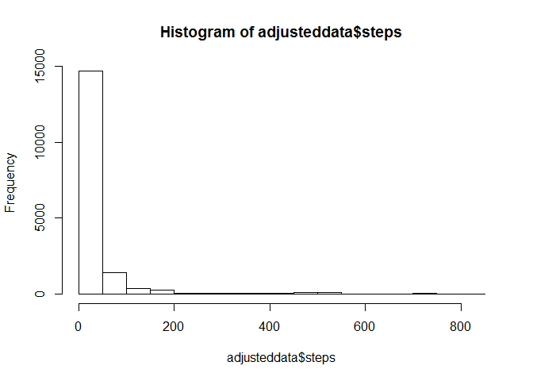

# Reproducible Research: Peer Assessment 1


## Loading and preprocessing the data

1. Load the data (i.e. read.csv())


```r
# create a temporary directory
td <- tempdir()
# create the placeholder file
tf <- tempfile(tmpdir=td, fileext=".zip")
# download into the placeholder file
download.file("http://d396qusza40orc.cloudfront.net/repdata%2Fdata%2Factivity.zip", tf, mode="wb")
# get the name of the first file in the zip archive
fname <- unzip(tf, list=TRUE)$Name[1]
# unzip the file to the temporary directory
unzip(tf, files=fname, exdir=td, overwrite=TRUE)
# fpath is the full path to the extracted file
fpath = file.path(td, fname)
# stringsAsFactors=TRUE will screw up conversion to numeric!
data <- read.csv(fpath, header=TRUE, row.names=NULL, 
             stringsAsFactors=FALSE, na.strings = "NA")
```

2. Process/transform the data (if necessary) into a format suitable for your analysis


```r
# convert second column as Date
data[,2] <- as.Date(data[,2])
# remove rows where steps are NA and store in nondata data.frame
nonadata <- data[!is.na(data[,1]),]
```

## What is mean total number of steps taken per day?

1. Make a histogram of the total number of steps taken each day


```r
# load data.table library
hist(data$steps)
```

 

2. Calculate and report the mean and median total number of steps taken per day


```r
# load data.table library
library(data.table)
# create data.table from nonadata
nonadatatable <- data.table(nonadata)
# show mean and median by date from nonadatatable
nonadatatable[,list(Mean=mean(steps),Median=median(steps)),by=date]
```

```
##           date       Mean Median
##  1: 2012-10-02  0.4375000      0
##  2: 2012-10-03 39.4166667      0
##  3: 2012-10-04 42.0694444      0
##  4: 2012-10-05 46.1597222      0
##  5: 2012-10-06 53.5416667      0
##  6: 2012-10-07 38.2465278      0
##  7: 2012-10-09 44.4826389      0
##  8: 2012-10-10 34.3750000      0
##  9: 2012-10-11 35.7777778      0
## 10: 2012-10-12 60.3541667      0
## 11: 2012-10-13 43.1458333      0
## 12: 2012-10-14 52.4236111      0
## 13: 2012-10-15 35.2048611      0
## 14: 2012-10-16 52.3750000      0
## 15: 2012-10-17 46.7083333      0
## 16: 2012-10-18 34.9166667      0
## 17: 2012-10-19 41.0729167      0
## 18: 2012-10-20 36.0937500      0
## 19: 2012-10-21 30.6284722      0
## 20: 2012-10-22 46.7361111      0
## 21: 2012-10-23 30.9652778      0
## 22: 2012-10-24 29.0104167      0
## 23: 2012-10-25  8.6527778      0
## 24: 2012-10-26 23.5347222      0
## 25: 2012-10-27 35.1354167      0
## 26: 2012-10-28 39.7847222      0
## 27: 2012-10-29 17.4236111      0
## 28: 2012-10-30 34.0937500      0
## 29: 2012-10-31 53.5208333      0
## 30: 2012-11-02 36.8055556      0
## 31: 2012-11-03 36.7048611      0
## 32: 2012-11-05 36.2465278      0
## 33: 2012-11-06 28.9375000      0
## 34: 2012-11-07 44.7326389      0
## 35: 2012-11-08 11.1770833      0
## 36: 2012-11-11 43.7777778      0
## 37: 2012-11-12 37.3784722      0
## 38: 2012-11-13 25.4722222      0
## 39: 2012-11-15  0.1423611      0
## 40: 2012-11-16 18.8923611      0
## 41: 2012-11-17 49.7881944      0
## 42: 2012-11-18 52.4652778      0
## 43: 2012-11-19 30.6979167      0
## 44: 2012-11-20 15.5277778      0
## 45: 2012-11-21 44.3993056      0
## 46: 2012-11-22 70.9270833      0
## 47: 2012-11-23 73.5902778      0
## 48: 2012-11-24 50.2708333      0
## 49: 2012-11-25 41.0902778      0
## 50: 2012-11-26 38.7569444      0
## 51: 2012-11-27 47.3819444      0
## 52: 2012-11-28 35.3576389      0
## 53: 2012-11-29 24.4687500      0
##           date       Mean Median
```

## What is the average daily activity pattern?

1. Make a time series plot (i.e. type = "l") of the 5-minute interval (x-axis) and the average number of steps taken, averaged across all days (y-axis)


```r
# 5-minute interval average number of steps taken across all days
plotdata <- nonadatatable[,list(AverageSteps=mean(steps)),by=interval]
# creating time serie plot
plot(plotdata[,interval],plotdata[,AverageSteps], xlab = "interval", ylab = "average number of steps taken", col = "black", type="l")
```

 

2. Which 5-minute interval, on average across all the days in the dataset, contains the maximum number of steps?


```r
# show 5-minute interval containing the maximum number of steps
plotdata[which.max(AverageSteps)]
```

```
##    interval AverageSteps
## 1:      835     206.1698
```

## Imputing missing values

Note that there are a number of days/intervals where there are missing values (coded as NA). The presence of missing days may introduce bias into some calculations or summaries of the data.

1. Calculate and report the total number of missing values in the dataset (i.e. the total number of rows with NAs)


```r
# count missing values
sum(is.na(data[,1]))
```

```
## [1] 2304
```

2. Devise a strategy for filling in all of the missing values in the dataset. The strategy does not need to be sophisticated. For example, you could use the mean/median for that day, or the mean for that 5-minute interval, etc.


```r
# 5-minute interval average number of steps taken across all days
missingdata <- nonadatatable[,list(AverageSteps=mean(steps)),by=interval]
```

3. Create a new dataset that is equal to the original dataset but with the missing data filled in.


```r
# copy data in new data.frame
adjusteddata <- data
# use mean for respective 5-minute interval for each NA values
adjusteddata[is.na(adjusteddata[,1]),1] <- missingdata[interval==adjusteddata[is.na(adjusteddata[,1]),3]][,AverageSteps]
```

4. Make a histogram of the total number of steps taken each day and Calculate and report the mean and median total number of steps taken per day. Do these values differ from the estimates from the first part of the assignment? What is the impact of imputing missing data on the estimates of the total daily number of steps?


```r
# load data.table library
hist(adjusteddata$steps)
```

 

```r
# create data.table from adjusteddata
adjusteddatatable <- data.table(adjusteddata)
# show mean and median by date from adjusteddatatable
adjusteddatatable[,list(Mean=mean(steps),Median=median(steps)),by=date]
```

```
##           date       Mean   Median
##  1: 2012-10-01 37.3825996 34.11321
##  2: 2012-10-02  0.4375000  0.00000
##  3: 2012-10-03 39.4166667  0.00000
##  4: 2012-10-04 42.0694444  0.00000
##  5: 2012-10-05 46.1597222  0.00000
##  6: 2012-10-06 53.5416667  0.00000
##  7: 2012-10-07 38.2465278  0.00000
##  8: 2012-10-08 37.3825996 34.11321
##  9: 2012-10-09 44.4826389  0.00000
## 10: 2012-10-10 34.3750000  0.00000
## 11: 2012-10-11 35.7777778  0.00000
## 12: 2012-10-12 60.3541667  0.00000
## 13: 2012-10-13 43.1458333  0.00000
## 14: 2012-10-14 52.4236111  0.00000
## 15: 2012-10-15 35.2048611  0.00000
## 16: 2012-10-16 52.3750000  0.00000
## 17: 2012-10-17 46.7083333  0.00000
## 18: 2012-10-18 34.9166667  0.00000
## 19: 2012-10-19 41.0729167  0.00000
## 20: 2012-10-20 36.0937500  0.00000
## 21: 2012-10-21 30.6284722  0.00000
## 22: 2012-10-22 46.7361111  0.00000
## 23: 2012-10-23 30.9652778  0.00000
## 24: 2012-10-24 29.0104167  0.00000
## 25: 2012-10-25  8.6527778  0.00000
## 26: 2012-10-26 23.5347222  0.00000
## 27: 2012-10-27 35.1354167  0.00000
## 28: 2012-10-28 39.7847222  0.00000
## 29: 2012-10-29 17.4236111  0.00000
## 30: 2012-10-30 34.0937500  0.00000
## 31: 2012-10-31 53.5208333  0.00000
## 32: 2012-11-01 37.3825996 34.11321
## 33: 2012-11-02 36.8055556  0.00000
## 34: 2012-11-03 36.7048611  0.00000
## 35: 2012-11-04 37.3825996 34.11321
## 36: 2012-11-05 36.2465278  0.00000
## 37: 2012-11-06 28.9375000  0.00000
## 38: 2012-11-07 44.7326389  0.00000
## 39: 2012-11-08 11.1770833  0.00000
## 40: 2012-11-09 37.3825996 34.11321
## 41: 2012-11-10 37.3825996 34.11321
## 42: 2012-11-11 43.7777778  0.00000
## 43: 2012-11-12 37.3784722  0.00000
## 44: 2012-11-13 25.4722222  0.00000
## 45: 2012-11-14 37.3825996 34.11321
## 46: 2012-11-15  0.1423611  0.00000
## 47: 2012-11-16 18.8923611  0.00000
## 48: 2012-11-17 49.7881944  0.00000
## 49: 2012-11-18 52.4652778  0.00000
## 50: 2012-11-19 30.6979167  0.00000
## 51: 2012-11-20 15.5277778  0.00000
## 52: 2012-11-21 44.3993056  0.00000
## 53: 2012-11-22 70.9270833  0.00000
## 54: 2012-11-23 73.5902778  0.00000
## 55: 2012-11-24 50.2708333  0.00000
## 56: 2012-11-25 41.0902778  0.00000
## 57: 2012-11-26 38.7569444  0.00000
## 58: 2012-11-27 47.3819444  0.00000
## 59: 2012-11-28 35.3576389  0.00000
## 60: 2012-11-29 24.4687500  0.00000
## 61: 2012-11-30 37.3825996 34.11321
##           date       Mean   Median
```

```r
# storing mean and median summary of adjusteddatatable
adjusteddatatablesummary <- adjusteddatatable[,list(Mean=mean(steps),Median=median(steps)),by=date]
# storing mean and median summary of nonadatatablesummary
nonadatatablesummary <- nonadatatable[,list(Mean=mean(steps),Median=median(steps)),by=date]
# set date as key in nonadatatable data.table
setkey(nonadatatablesummary,"date")
# set date as key in adjusteddatatable data.table
setkey(adjusteddatatablesummary,"date")
# joining the 2 summaries to show the differences
nonadatatablesummary[adjusteddatatablesummary]
```

```
##           date       Mean Median     i.Mean i.Median
##  1: 2012-10-01         NA     NA 37.3825996 34.11321
##  2: 2012-10-02  0.4375000      0  0.4375000  0.00000
##  3: 2012-10-03 39.4166667      0 39.4166667  0.00000
##  4: 2012-10-04 42.0694444      0 42.0694444  0.00000
##  5: 2012-10-05 46.1597222      0 46.1597222  0.00000
##  6: 2012-10-06 53.5416667      0 53.5416667  0.00000
##  7: 2012-10-07 38.2465278      0 38.2465278  0.00000
##  8: 2012-10-08         NA     NA 37.3825996 34.11321
##  9: 2012-10-09 44.4826389      0 44.4826389  0.00000
## 10: 2012-10-10 34.3750000      0 34.3750000  0.00000
## 11: 2012-10-11 35.7777778      0 35.7777778  0.00000
## 12: 2012-10-12 60.3541667      0 60.3541667  0.00000
## 13: 2012-10-13 43.1458333      0 43.1458333  0.00000
## 14: 2012-10-14 52.4236111      0 52.4236111  0.00000
## 15: 2012-10-15 35.2048611      0 35.2048611  0.00000
## 16: 2012-10-16 52.3750000      0 52.3750000  0.00000
## 17: 2012-10-17 46.7083333      0 46.7083333  0.00000
## 18: 2012-10-18 34.9166667      0 34.9166667  0.00000
## 19: 2012-10-19 41.0729167      0 41.0729167  0.00000
## 20: 2012-10-20 36.0937500      0 36.0937500  0.00000
## 21: 2012-10-21 30.6284722      0 30.6284722  0.00000
## 22: 2012-10-22 46.7361111      0 46.7361111  0.00000
## 23: 2012-10-23 30.9652778      0 30.9652778  0.00000
## 24: 2012-10-24 29.0104167      0 29.0104167  0.00000
## 25: 2012-10-25  8.6527778      0  8.6527778  0.00000
## 26: 2012-10-26 23.5347222      0 23.5347222  0.00000
## 27: 2012-10-27 35.1354167      0 35.1354167  0.00000
## 28: 2012-10-28 39.7847222      0 39.7847222  0.00000
## 29: 2012-10-29 17.4236111      0 17.4236111  0.00000
## 30: 2012-10-30 34.0937500      0 34.0937500  0.00000
## 31: 2012-10-31 53.5208333      0 53.5208333  0.00000
## 32: 2012-11-01         NA     NA 37.3825996 34.11321
## 33: 2012-11-02 36.8055556      0 36.8055556  0.00000
## 34: 2012-11-03 36.7048611      0 36.7048611  0.00000
## 35: 2012-11-04         NA     NA 37.3825996 34.11321
## 36: 2012-11-05 36.2465278      0 36.2465278  0.00000
## 37: 2012-11-06 28.9375000      0 28.9375000  0.00000
## 38: 2012-11-07 44.7326389      0 44.7326389  0.00000
## 39: 2012-11-08 11.1770833      0 11.1770833  0.00000
## 40: 2012-11-09         NA     NA 37.3825996 34.11321
## 41: 2012-11-10         NA     NA 37.3825996 34.11321
## 42: 2012-11-11 43.7777778      0 43.7777778  0.00000
## 43: 2012-11-12 37.3784722      0 37.3784722  0.00000
## 44: 2012-11-13 25.4722222      0 25.4722222  0.00000
## 45: 2012-11-14         NA     NA 37.3825996 34.11321
## 46: 2012-11-15  0.1423611      0  0.1423611  0.00000
## 47: 2012-11-16 18.8923611      0 18.8923611  0.00000
## 48: 2012-11-17 49.7881944      0 49.7881944  0.00000
## 49: 2012-11-18 52.4652778      0 52.4652778  0.00000
## 50: 2012-11-19 30.6979167      0 30.6979167  0.00000
## 51: 2012-11-20 15.5277778      0 15.5277778  0.00000
## 52: 2012-11-21 44.3993056      0 44.3993056  0.00000
## 53: 2012-11-22 70.9270833      0 70.9270833  0.00000
## 54: 2012-11-23 73.5902778      0 73.5902778  0.00000
## 55: 2012-11-24 50.2708333      0 50.2708333  0.00000
## 56: 2012-11-25 41.0902778      0 41.0902778  0.00000
## 57: 2012-11-26 38.7569444      0 38.7569444  0.00000
## 58: 2012-11-27 47.3819444      0 47.3819444  0.00000
## 59: 2012-11-28 35.3576389      0 35.3576389  0.00000
## 60: 2012-11-29 24.4687500      0 24.4687500  0.00000
## 61: 2012-11-30         NA     NA 37.3825996 34.11321
##           date       Mean Median     i.Mean i.Median
```

## Are there differences in activity patterns between weekdays and weekends?

For this part the weekdays() function may be of some help here. Use the dataset with the filled-in missing values for this part.

1. Create a new factor variable in the dataset with two levels - "weekday" and "weekend" indicating whether a given date is a weekday or weekend day.


```r
# copy data in new data.frame
adjusteddata <- data
# use mean for respective 5-minute interval for each NA values
adjusteddata[is.na(adjusteddata[,1]),1] <- missingdata[interval==adjusteddata[is.na(adjusteddata[,1]),3]][,AverageSteps]
# adding a column named wd to adjusteddata which indicates wheter it's a weekday or weekend
adjusteddata[,4] <- "weekday"
adjusteddata[weekdays(adjusteddata[,2]) == "Saturday" | weekdays(adjusteddata[,2]) == "Sunday",4] <- "weekend"
names(adjusteddata)[4] <- "wd"
# setting wd as factor
adjusteddata[,4] <- as.factor(adjusteddata[,4])
```

2. Make a panel plot containing a time series plot (i.e. type = "l") of the 5-minute interval (x-axis) and the average number of steps taken, averaged across all weekday days or weekend days (y-axis). 


```r
# create data.table from adjusteddata
adjusteddatatable <- data.table(adjusteddata)
# 5-minute interval average number of steps taken across all days
plotdata <- adjusteddatatable[,list(AverageSteps=mean(steps)),by=list(interval,wd)]
# creating 2 time serie plots, one for weekends and one for weekdays
library(lattice)
xyplot(AverageSteps ~ interval | wd, data=plotdata, type='l')
```

 
